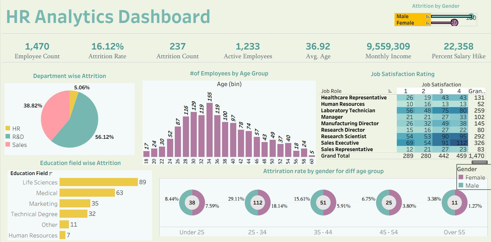

# 📊 HR Analytics Dashboard – Tableau

## 🔍 Project Overview  
The **HR Analytics Dashboard** is an interactive Tableau visualization designed to analyze and monitor key **workforce metrics** such as attrition rate, employee demographics, salary distribution, and job satisfaction levels.  
This project helps **HR managers, executives, and decision-makers** gain actionable insights into employee behavior, workforce structure, and potential risk areas.  

## 📊 Dashboard Preview  
  
---------------

## 🎯 Objectives  
- Analyze **employee attrition patterns** across departments, age groups, and education levels.  
- Identify **salary trends and job satisfaction ratings** by role.  
- Provide **KPI-driven insights** for HR teams to make informed decisions.  
- Create a **centralized dashboard** that highlights both **macro (overall workforce)** and **micro (department/role-level)** insights.  

---


## 📌 Key Features  

### ✅ Top KPIs  
- **Employee Count** → Total workforce (1,470 employees).  
- **Attrition Rate** → % of employees leaving (16.12%).  
- **Attrition Count** → Total number of employees who left (237 employees).  
- **Active Employees** → Currently working employees (1,233).  
- **Average Age** → Mean workforce age (36.9 years).  
- **Monthly Income** → Total salary paid (≈ 9.55M).  
- **Percent Salary Hike** → Average hike percentage (22.3%).  

### ✅ Visual Insights  
- **Department-wise Attrition** → Pie chart showing attrition share:  
  - R&D = **56.12%** (largest share of attrition).  
  - Sales = **38.82%** (second highest).  
  - HR = **5.06%** (smallest, but still notable).  

- **Employee Distribution by Age Group** → Histogram shows peak workforce in **30–35 years** range.  
- **Education Field vs Attrition** → Life Sciences & Medical employees experience the highest attrition.  
- **Job Satisfaction Rating** → Heatmap reveals job roles with **low to moderate satisfaction** (notably Sales Executives).  
- **Attrition by Gender & Age Group** → Donut charts show **higher attrition in females under 25 and 25–34 age groups** compared to males.  


---

## 🧠 Detailed Insights & Interview Preparation Notes  

Here are the **actionable findings** from this dashboard (you can use these as talking points in interviews):  

### 1. Workforce Composition  
- **Total Workforce**: 1,470 employees, with majority concentrated in the **30–35 age bracket**.  
- Insight: Company has a **mid-career heavy workforce**, meaning retention in this group is crucial.  

### 2. Attrition Analysis  
- **Overall Attrition Rate**: 16.12% – considered **moderately high** (benchmark: 10–12%).  
- **Department-level Insight**:  
  - R&D has the highest attrition (**56% of total exits**). Possible causes: stress, workload, or lack of growth opportunities.  
  - Sales is the second highest (**39% attrition**). Could relate to performance pressure or incentive structures.  
  - HR has very low attrition (5%), indicating relatively stable roles.  

➡ **Interview Talking Point**: *“If I were an HR analyst, I’d recommend conducting focused surveys and exit interviews in R&D and Sales to identify specific pain points leading to higher attrition.”*  

### 3. Gender-based Attrition  
- Female employees show **higher attrition rates** in younger age groups (Under 25, 25–34).  
- Male employees are relatively more stable across age groups.  
- Possible causes: work-life balance, lack of flexible policies, maternity-related attrition.  

➡ **Interview Talking Point**: *“This insight suggests HR should consider gender-focused retention strategies such as flexible hours or mentorship programs for younger female employees.”*  

### 4. Education and Attrition  
- Employees with **Life Sciences** and **Medical backgrounds** show the highest attrition counts.  
- Technical Degree & Marketing roles also show notable exits.  
- Possible reason: More opportunities outside the company in these fields.  

➡ **Interview Talking Point**: *“This may indicate that employees with niche degrees are in demand externally. The company should design career progression programs for these groups.”*  

### 5. Job Satisfaction Trends  
- Heatmap reveals **Sales Executives** have relatively **low job satisfaction** despite being a large workforce group (326 employees).  
- Research Scientists and Managers show balanced satisfaction but still have areas of dissatisfaction.  

➡ **Interview Talking Point**: *“Low satisfaction in Sales Executives should be a red flag since it’s a large department and directly affects revenue. HR should recheck incentive schemes and workload distribution.”*  

### 6. Salary & Incentives  
- **Average Monthly Income**: 6,503.  
- **Percent Salary Hike**: 22.3% (quite competitive).  
- Despite a good hike %, attrition remains high → this shows **money alone is not solving retention problems**.  

➡ **Interview Talking Point**: *“Compensation is not the only factor; engagement, growth opportunities, and culture also drive retention.”*  

---

## 🛠️ Tech Stack  
- **Tool**: Tableau Desktop Public Edition  
- **Data Source**: HR Dataset (CSV/Excel format)  
- **KPIs & Metrics**: Custom calculated fields (Attrition Rate, Active Employees, Avg Age, etc.)  
- **Visualization Types**: KPI cards, pie chart, histogram, bar chart, donut chart, heatmap  

---

## 📈 Business Value  
This dashboard empowers HR teams to:  
- Detect **high attrition areas** and implement retention strategies.  
- Understand **demographic trends** to optimize hiring strategies.  
- Assess **job satisfaction** to improve employee engagement.  
- Track **salary distribution** and **hike percentages** for compensation planning.  

---

## 🚀 How to Use  
1. Download Tableau Public Desktop [here](https://public.tableau.com/en-us/s/download).  
2. Clone this repository:  
   ```bash
   git clone https://github.com/your-username/hr-analytics-dashboard.git
